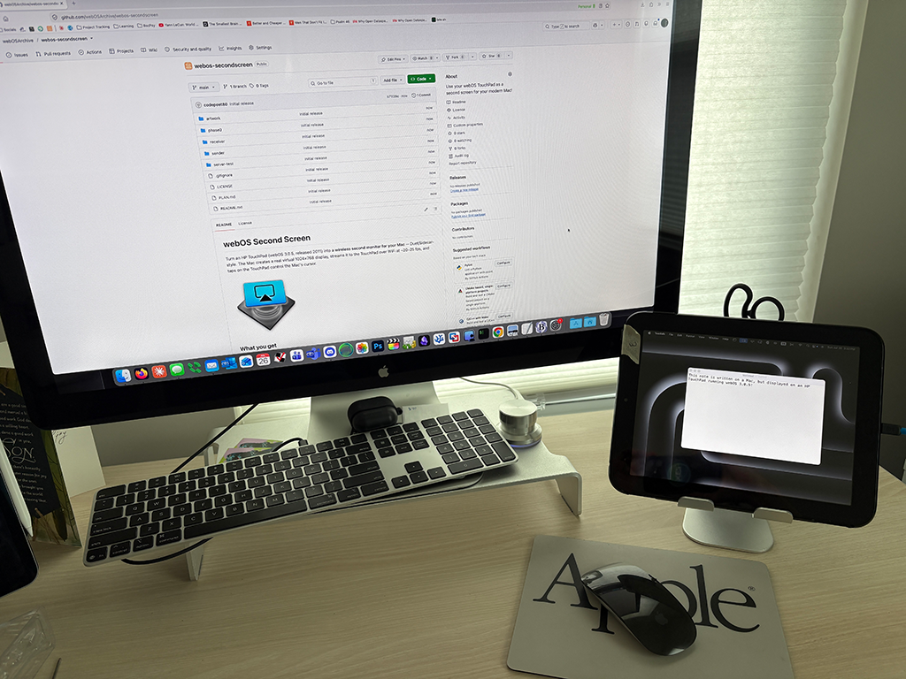

# webOS Second Screen

Turn an HP TouchPad (webOS 3.0.5, released 2011) into a **wireless second
monitor for your Mac** — Duet/Sidecar-style. The Mac creates a real
virtual 1024×768 display, streams it to the TouchPad over WiFi at
~20–25 fps, and taps on the TouchPad control the Mac's cursor.


## What you get

- A true **extended desktop** (not a mirror): the virtual display shows
  up in System Settings → Displays, you arrange it like any monitor, and
  windows dragged onto it appear on the TouchPad.
- **Touch control**: tap, drag, double-tap on the TouchPad → mouse on
  the Mac.
- **Plug-and-play setup**: connect the TouchPad over USB once, open the
  Mac app — it configures and launches the receiver automatically
  (streaming itself runs over WiFi).
- ~150 ms latency, ~12 Mbps on your LAN. Fine for dashboards, chat,
  documents, video; it won't replace Sidecar for fast motion.



## Quick start

### Pre-requisites

- Ensure your TouchPad is in Developer Mode, connected to the same WiFi network, and optionally (but highly recommended) [connected to your Mac via USB with novacom](https://docs.webosarchive.org/appstores/#prepare-your-computer) to enable auto-configuration.

### TouchPad

- Install webOS Second Screen from the webOS Archive App Catalog:
[appcatalog.webosarchive.org/app/webOSSecondScreen](https://appcatalog.webosarchive.org/app/webOSSecondScreen)

- Don't launch the app yet. If connected over USB, the Mac will do it for you after configuring the receiver!

### Mac

- Download the latest [Release](https://github.com/webOSArchive/webos-secondscreen/releases).

- Launch **webOS Second Screen.app** (or [build it](#building) from source: `cd sender && ./package-app.sh`). 

- *IMPORTANT:* Grant the Screen Recording and Accessibility permissions when prompted, 
launch again, and the virtual display comes up. 

- If the TouchPad is connected over USB, the receiver is automatically pointed at your Mac and started automatically.

- If you cannot connect via USB, you must set the the server (that is, the Mac sender) address once on the device:

```sh
echo "host=<your-mac-ip>" > /media/internal/secondscreen.conf
```

Then launch the TouchPad app manually.

- The receiver reconnects automatically every 2 s, so start/stop order never matters. If your Mac's IP changes, the receiver re-reads the config every minute while disconnected and self-heals. After an hour with no connection it exits on its own so it won't keep the TouchPad's screen on all night.

- The receiver checks the App Catalog for updates at startup and offers to install a newer version via Preware.

## Parts

| Directory | What it is |
|-----------|------------|
| `sender/` | Mac app (Swift, macOS 13+). Virtual display via `CGVirtualDisplay`, ScreenCaptureKit capture, MJPEG over TCP, CGEvent touch injection. |
| `receiver/` | TouchPad PDK app (C, SDL 1.2 + OpenGL ES 1.1, NEON libjpeg-turbo). |
| `receiver/PROTOCOL.md` | The tiny wire protocol between them. |
| `server-test/` | Python reference server for receiver development. |
| `artwork/` | Icons. |
| `phase0/`, `PLAN.md` | The development journal: how this was figured out, ffmpeg-based prototypes, and every webOS/macOS gotcha hit along the way. |

## Building

- **Mac sender**: `cd sender && swift build -c release` — see
  [sender/README.md](sender/README.md) (flags, packaging, notarization,
  design notes).
- **TouchPad receiver**: cross-compiled with Linaro GCC 4.9.4 + PalmPDK —
  see [receiver/README.md](receiver/README.md) and
  [receiver/third_party/README.md](receiver/third_party/README.md) for
  the vendored NEON libjpeg-turbo build.

## How it works (short version)

The Mac side creates a 1024×768 virtual monitor with the private-but-
stable `CGVirtualDisplay` API, captures it with ScreenCaptureKit, and
encodes baseline JPEGs (the TouchPad's PDK apps can't reach the hardware
H.264 decoder, so MJPEG + NEON libjpeg-turbo is the sweet spot: ~30 ms
decode + ~5 ms RGB565 GL upload per frame on the Cortex-A8). Frames are
framed over a single TCP connection with **latest-frame-wins** pacing on
both ends, so latency stays bounded instead of growing with TCP
backpressure. The receiver sends touch events back on the same socket;
the sender maps them into the virtual display's coordinates and injects
CGEvents. `PLAN.md` has the long version, including all measurements.

## Acknowledgements

- [libjpeg-turbo](https://libjpeg-turbo.org/) (vendored static NEON
  build for the receiver).
- The `CGVirtualDisplay` interface shapes follow prior art in
  [FluffyDisplay](https://github.com/tml1024/FluffyDisplay) and
  [DeskPad](https://github.com/Stengo/DeskPad).
- The webOS homebrew community, for keeping these lovely devices alive.
